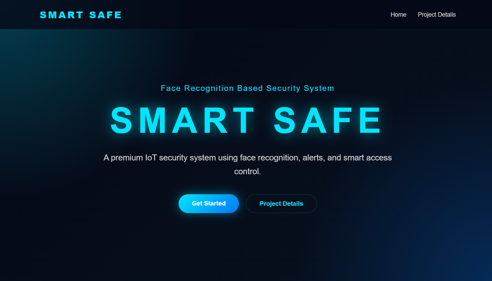
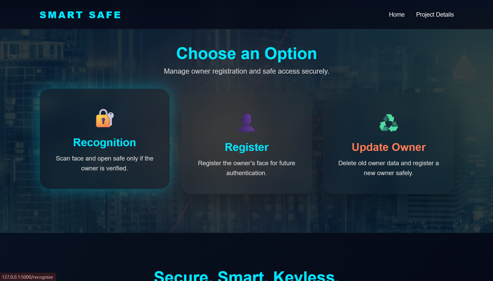

# 🔐 SmartSafe – Facial and Expression Authentication System

# 📖 Overview

SmartSafe is an IoT-based intelligent security system that combines facial recognition, facial expression verification, and hardware-based access control to provide enhanced security for lockers, safes, doors, and restricted areas.

Unlike traditional password-based systems, SmartSafe verifies both the user's identity and real-time presence through a two-stage authentication mechanism.

The system first performs face recognition using OpenCV and LBPH. Once the face is verified, the user must complete a randomly generated facial movement challenge using MediaPipe. Only after successfully passing both stages is access granted.

The system also provides real-time security monitoring through intruder detection, buzzer alerts, LCD notifications, email alerts, and servo-controlled locking mechanisms.

---

# ✨ Key Features

| Feature | Description |
|----------|-------------|
| Face Recognition | Identifies registered owner |
| Facial Expression Verification | Prevents spoofing attacks |
| Intruder Detection | Detects unauthorized users |
| Email Alerts | Sends intruder image to owner |
| Buzzer Alarm | Activates on failed attempts |
| LCD Notifications | Displays system status |
| Servo Motor Lock | Unlocks safe automatically |
| Owner Update Module | Allows secure owner re-registration |
| Security Questions | Verifies owner before updates |
| Real-Time Monitoring | Live authentication process |
| Flask Web Interface | User-friendly browser interface |

---

# 🎯 Problem Statement

Traditional security methods such as passwords, keys, PINs, and cards can be lost, stolen, copied, or shared.

Most facial recognition systems are also vulnerable to spoofing attacks using photographs or videos.

Therefore, a secure authentication system capable of verifying both identity and real-time user presence is required.

SmartSafe addresses this issue through a dual-layer authentication mechanism combining face recognition and facial expression verification.

---

# 🎯 Project Objectives

- Develop a secure facial recognition-based authentication system.
- Prevent spoofing attacks using facial movement verification.
- Provide real-time intruder detection.
- Generate email alerts for unauthorized access attempts.
- Integrate hardware components using Arduino Uno.
- Control physical access using a servo motor lock.
- Display authentication results using an LCD display.
- Improve security compared to conventional authentication methods.

---

# 🏗️ Main System Flow

```text
                    ┌─────────────────────┐                        
                    │      USER           │
                    └──────────┬──────────┘                                
                               │
                               ▼
                    ┌─────────────────────┐
                    │ Laptop Camera       │
                    └──────────┬──────────┘
                               │
                               ▼
                    ┌─────────────────────┐
                    │ Haar Cascade        │
                    │ Face Detection      │
                    └──────────┬──────────┘
                               │
                               ▼
                    ┌─────────────────────┐
                    │ LBPH Face           │
                    │ Recognition         │
                    └──────────┬──────────┘
                               │
                           Face Match?
                               │
                   ┌───────────┴───────────┐
                   │                       │
                  NO                      YES
                   │                       │
                   ▼                       ▼
            ┌──────────────┐      ┌──────────────────┐
            │ Capture      │      │ MediaPipe        │
            │ Intruder     │      │ Expression Check │
            └──────┬───────┘      └────────┬─────────┘
                   │                       │
                   ▼                       ▼
            ┌──────────────┐      Expression Correct?
            │ Email Alert  │              │
           └──────┬───────┘      ┌────────┴────────┐
                  │              │                 │
                  ▼             NO                YES
           ┌──────────────┐      │                 │
           │ Buzzer ON    │      ▼                 ▼
           └──────────────┘  Access Denied   Servo Unlock
                                             LCD Success


# Updating Process

                     ┌──────────────────┐
                     │  Update Owner    │
                     └────────┬─────────┘
                              │
                              ▼
                 ┌────────────────────────┐
                 │ Security Questions     │
                 │ Verification           │
                 └────────┬───────────────┘
                           
                          ▼
                 All Answers Correct?
                          │
             ┌────────────┴────────────┐
             │                         │
            NO                        YES
             │                         │
             ▼                         ▼
   ┌─────────────────┐      ┌──────────────────┐
   │ Access Denied   │      │ Clear Existing   │
   └─────────────────┘      │ Face Dataset     │
                            └────────┬─────────┘
                                     │
                                     ▼
                            ┌──────────────────┐
                            │ Capture 35 Face  │
                            │ Images           │
                            └────────┬─────────┘
                                     │
                                     ▼
                            ┌──────────────────┐
                            │ Train LBPH       │
                            │   Model          │
                            └────────┬─────────┘
                                     │
                                     ▼
                            ┌──────────────────┐
                            │ Update Email     │
                            │ (Optional)       │
                            └────────┬─────────┘
                                     │
                                     ▼
                            ┌──────────────────┐
                            │ Save New Owner   │
                            │ Information      │
                            └────────┬─────────┘
                                     │
                                     ▼
                            ┌──────────────────┐
                            │ Face Saved       │
                            │ Successfully     │
                            └────────┬─────────┘
                                     │
                                     ▼
                                    END

```

---

# 🗄️ Database Structure

```text
DATABASE

├── Registered Email
│
├── Face Dataset
│   ├── owner_1.jpg
│   ├── owner_2.jpg
│   ├── ...
│   └── owner_35.jpg
│
├── trainer.yml
│
├── Security Questions
│   ├── Question 1
│   ├── Question 2
│   └── Question 3
│
├── Security Answers
│
├── Intruder Images
│
└── Access Logs
```

---

# 🧠 Facial Expression Verification

The system uses MediaPipe to generate random facial movement challenges.

### Supported Challenges

- Move Left
- Move Right
- Move Up
- Move Down
- Move Closer
- Move Away

The user must correctly perform the displayed challenge before access is granted.

This ensures that a real person is present and prevents spoofing using photographs or videos.

---

# 🔒 Owner Update Process

To update registered owner data:

1. Owner selects Update Owner.
2. System asks 3 security questions.
3. Owner answers all questions correctly.
4. Existing face data is cleared.
5. New face images are captured.
6. New model is trained.
7. Owner may keep existing email or update email.
8. System saves updated information.

---

# 📦 Hardware Components

| Component | Purpose |
|------------|---------|
| Arduino Uno | Hardware controller |
| Laptop Camera | Face capture |
| Servo Motor | Lock control |
| LCD Display | Status display |
| Buzzer | Alert generation |
| Jumper Wires | Hardware connections |
| Breadboard | Circuit assembly |
| USB Cable | Communication |

---

# 💻 Software Requirements

| Software | Purpose |
|------------|---------|
| Python | Backend Development |
| Flask | Web Framework |
| OpenCV | Face Detection & Recognition |
| MediaPipe | Facial Movement Verification |
| Haar Cascade | Face Detection |
| LBPH | Face Recognition |
| HTML | User Interface |
| CSS | Frontend Styling |
| SMTP | Email Notifications |
| Arduino IDE | Arduino Programming |

---

# 📥 Input Specifications

- Face image captured using camera
- Stored face dataset
- Facial movement challenge response
- Security question answers
- Email address

---

# 📤 Output Specifications

- Access Granted
- Access Denied
- LCD Notifications
- Servo Motor Unlock
- Buzzer Alert
- Email Alert with Intruder Image
- Updated Owner Registration

---

# 📺 LCD Status Messages

The LCD display shows:

- Scanning Face
- Please Wait
- Verifying
- Access Granted
- Access Denied
- Registering Face
- Face Saved Successfully

---

# 🚪 Lock Control

- Safe lock controlled using Servo Motor.
- Unlock duration: 2–3 seconds.
- Automatically locks after timeout.

---

# 🧩 Module Description

### Image Capture Module
Captures user face images using the laptop camera.

### Face Detection Module
Detects face regions using Haar Cascade classifiers.

### Face Recognition Module
Uses LBPH to compare captured faces with registered face data.

### Expression Verification Module
Uses MediaPipe to validate real-time facial movements.

### Hardware Interface Module
Communicates with Arduino Uno through serial communication.

### Alert Module
Triggers buzzer alerts and email notifications.

### LCD Module
Displays authentication and system status messages.

### Owner Update Module
Allows secure updating of owner information.

---

# 🌍 Applications

- Smart Door Locks
- Home Security Systems
- Office Access Control
- Attendance Systems
- Educational Institutions
- Laboratories
- Banks
- Restricted Area Access Control
- Smart Lockers
- Smart Safes

---

# ⚠️ Challenges

- Maintaining proper lighting conditions
- Handling facial appearance changes
- Maintaining camera positioning
- Preventing false detections
- Ensuring reliable hardware communication
- Handling real-time image processing

---

# 📂 Project Structure

```text
SMARTSAFE
│
├── app.py
├── register_face.py
├── recognize_face.py
├── training.py
├── update_owner.py
├── challenge_auth.py
├── challenge_face.py
├── arduino_control.py
├── trainer.yml
├── arduino.ino
├── owner_email.txt
├── owner_registered.txt
├── owner_1.jpg
├── owner_2.jpg
├── ...
├── owner_35.jpg
│
├── images/
│   ├── stores images used in the Frontend
│   
├── templates/
│   ├── index.html
│   ├── change_email_choice.html
│   ├── challenge.html
│   └── email.html
│   ├── register.html
│   ├── recognize.html
│   ├── update_owner.html
│   ├── project_details.html
│   ├── owner_quiz.html
│   ├── update_email.html
│
├── static/
│   ├── images/
│   ├  ├── stores images used in the Frontend
│   ├── style.css
│   
└── README.md
```

---

# 📸 Project Screenshots

## Basic webpage

<p align="center">
  
  
</p>

## Front Implementation

(Add Screenshot Here)

## Hardware Implementation

(Add Screenshot Here)

## System Architecture

---

# 🚀 Future Enhancements

- Mobile Application Integration
- Cloud Database Support
- Multi-Factor Authentication
- Voice Recognition
- Fingerprint Authentication
- Iris Recognition
- Improved AI Models
- Smart Home Integration
- Multiple User Support
- Remote Monitoring Dashboard

---

## 🎓 Learning Outcomes

Through this project, we gained practical experience in:

- Computer Vision using OpenCV
- Facial Landmark Detection using MediaPipe
- Face Recognition using LBPH
- Flask Web Application Development
- Arduino-Python Serial Communication
- IoT Hardware Integration
- Servo Motor Control
- LCD Interfacing
- Email Automation using SMTP
- Real-Time Authentication Systems
- Security System Design
- Software-Hardware Integration

---

## 🚀 Deployment

### Software Setup

1. Install Python 3.x
2. Install required libraries
3. Connect Arduino Uno
4. Upload Arduino code
5. Run Flask application

```bash
python app.py

---

# ✅ Conclusion

SmartSafe provides a secure and intelligent authentication solution by combining facial recognition with facial expression verification.

The dual-verification mechanism significantly improves security by preventing unauthorized access and spoofing attacks. Integration with IoT hardware enables real-time operation, servo-controlled access, LCD notifications, buzzer alerts, and instant email notifications.

The system demonstrates how Artificial Intelligence, Computer Vision, and IoT can be integrated to create a reliable and practical smart security solution.

---

# 📚 References

- Python Documentation – https://www.python.org
- OpenCV Documentation – https://opencv.org
- Face Recognition Documentation – https://face-recognition.readthedocs.io
- Arduino Documentation – https://www.arduino.cc
- MediaPipe Documentation – https://ai.google.dev/edge/mediapipe
- Flask Documentation – https://flask.palletsprojects.com
- HTML Documentation – https://developer.mozilla.org/en-US/docs/Web/HTML
- CSS Documentation – https://developer.mozilla.org/en-US/docs/Web/CSS
- IEEE Xplore – https://ieeexplore.ieee.org
